# dataprochs 🐘🐝
dataprochs : Dataproc Cluster # Apache # Hadoop # MapReduce # Spark # YARN # HDFS

## Objective

Create a Dataproc cluster in Google Cloud.
Run Apache Spark job (estimates Pi value using Monte Carlo method).
Modify number of workers in cluster.

## Dataproc Cluster

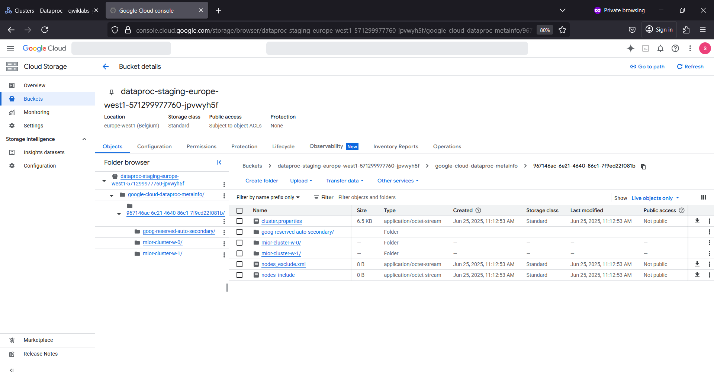

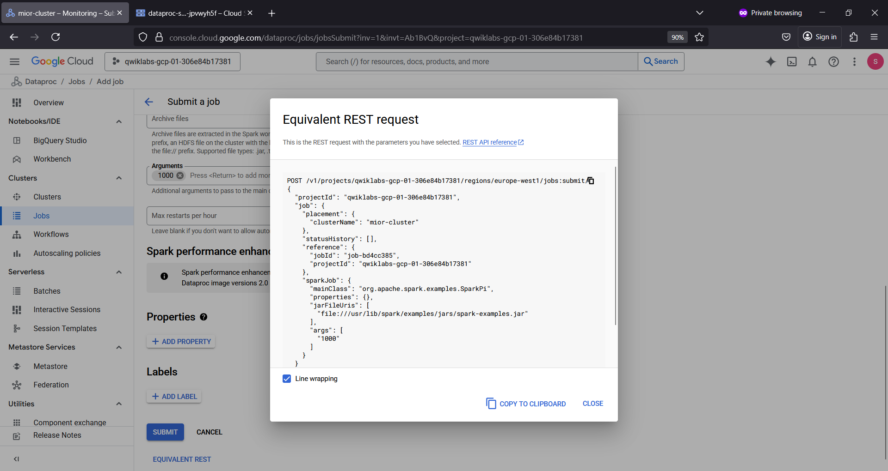

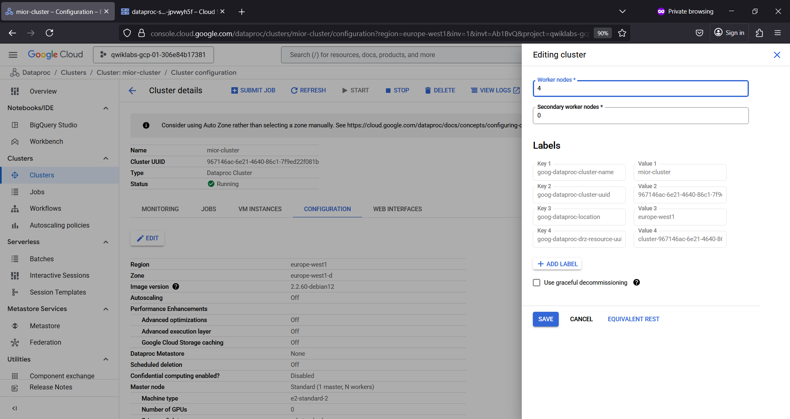

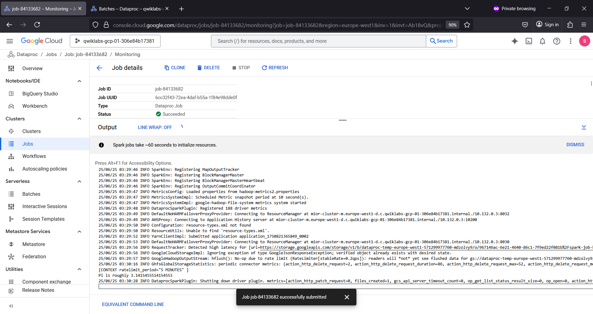

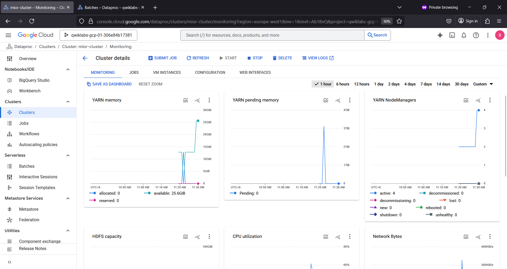

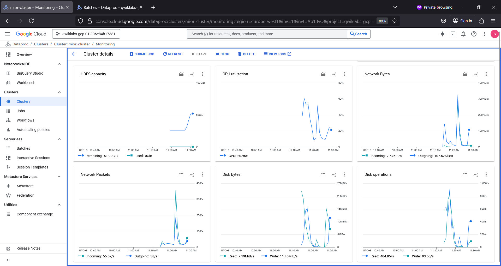

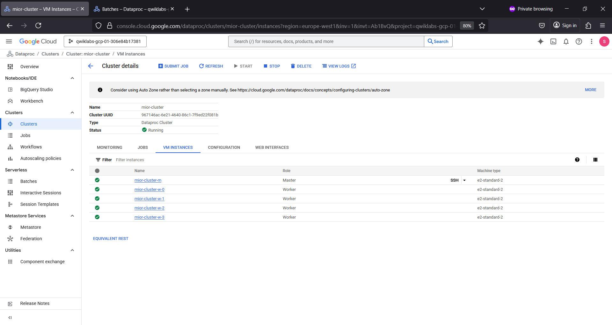

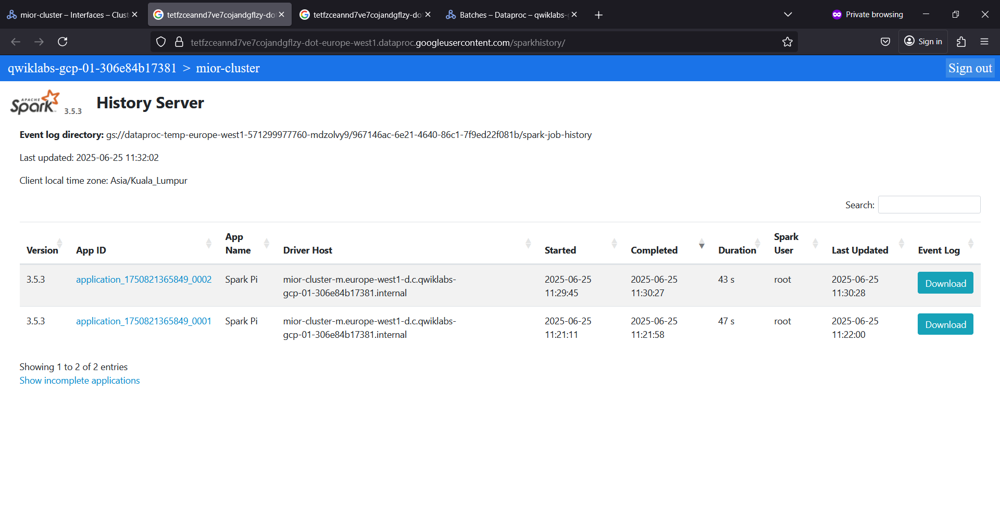

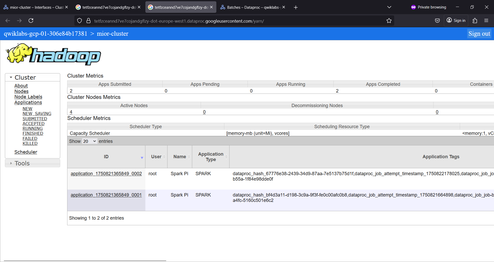

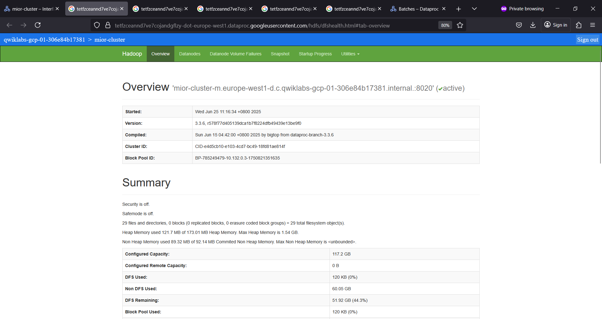

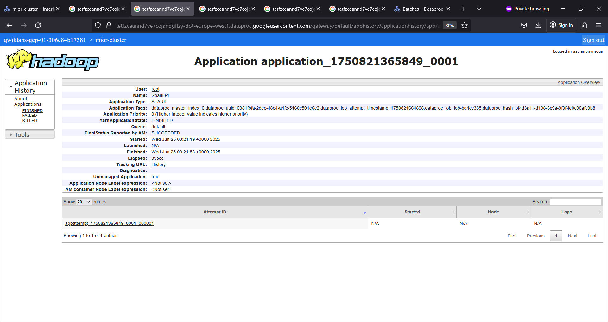

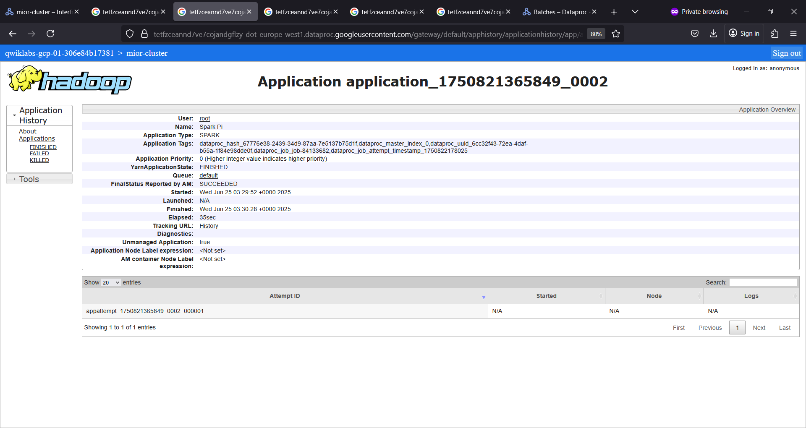

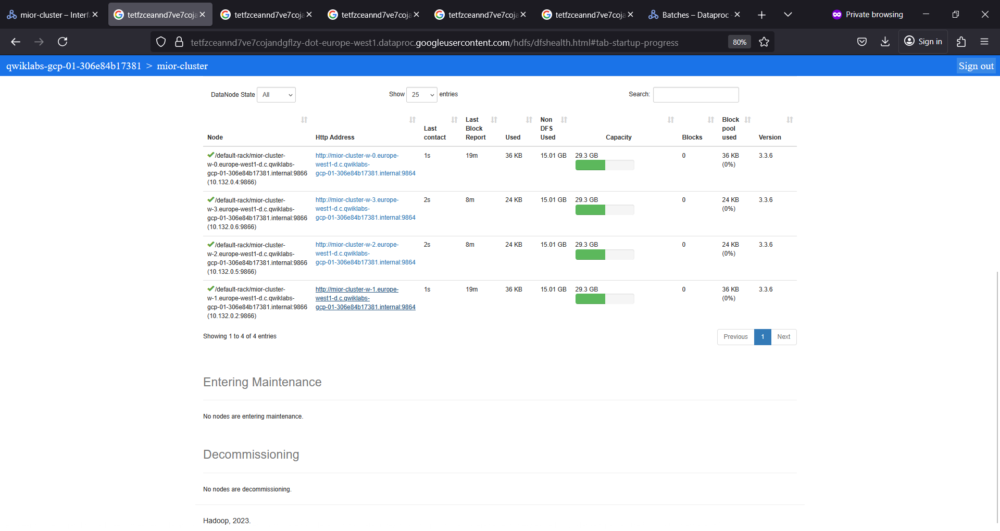

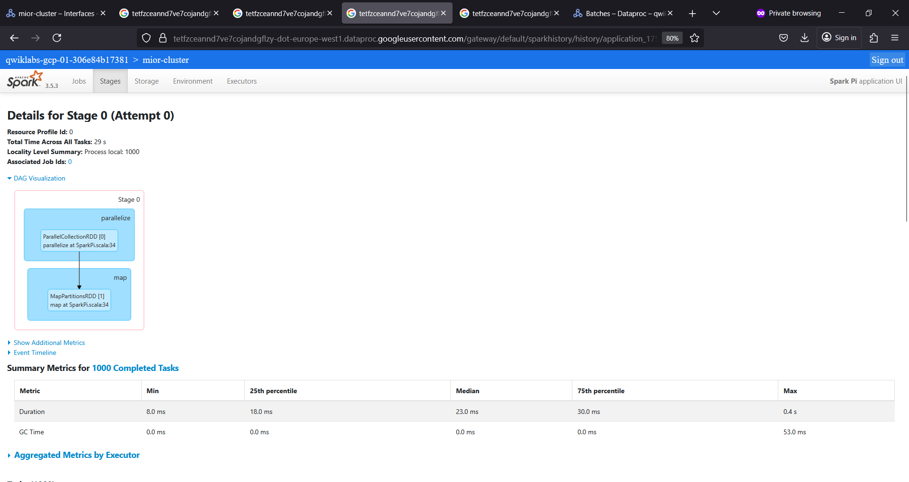

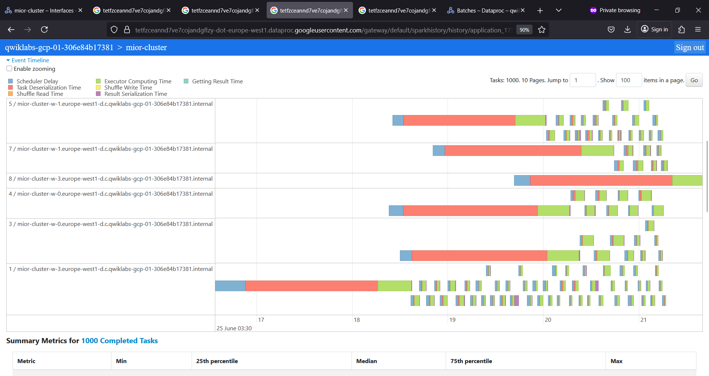

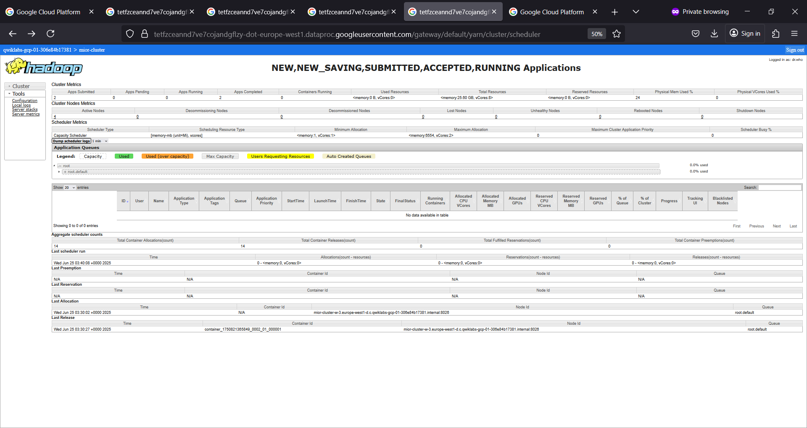

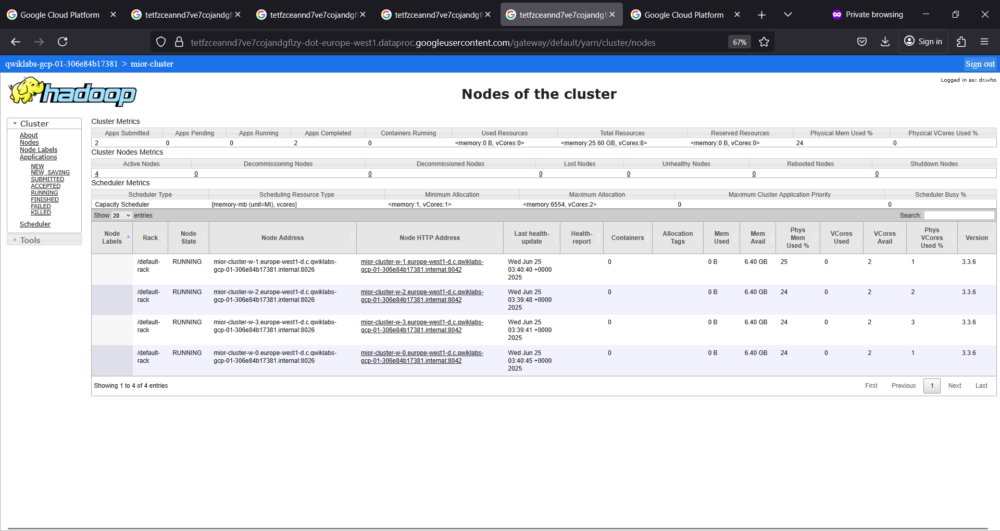

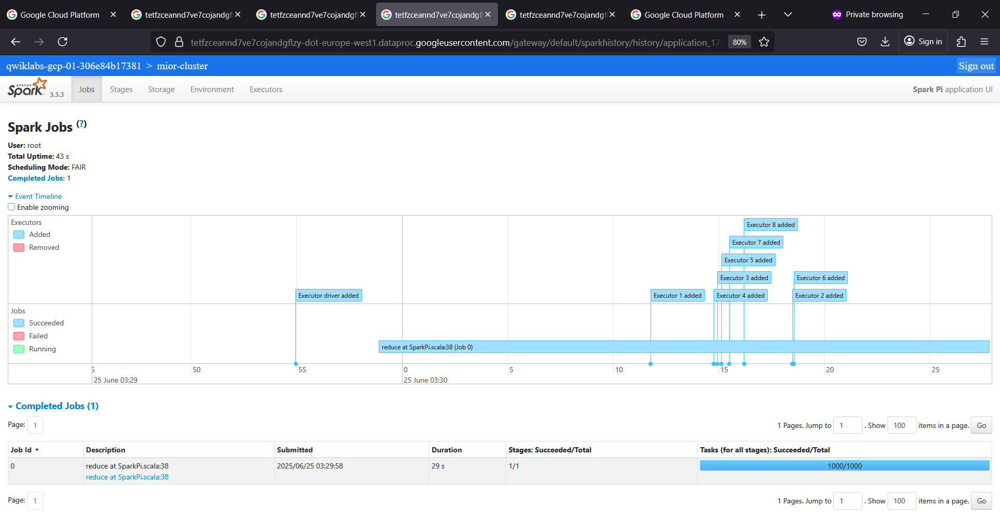

